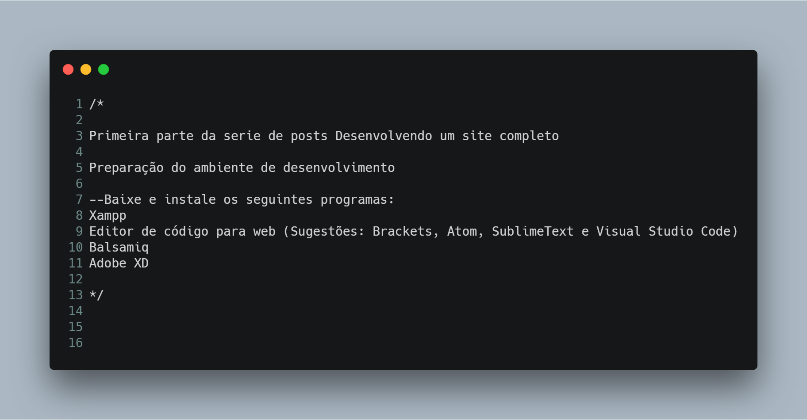

# Construindo-um-site-do-zero

## Repositório voltado para guardar as imagens do projeto 
 Este projeto visa ensinar de uma maneira bem legal como desenvolver um site do zero. Se você não sabe nada de código, não se preocupe que aqui você irá aprender tudo sem nenhuma complicação. Para começar baixe os seguintes programas listados abaixo.
  

