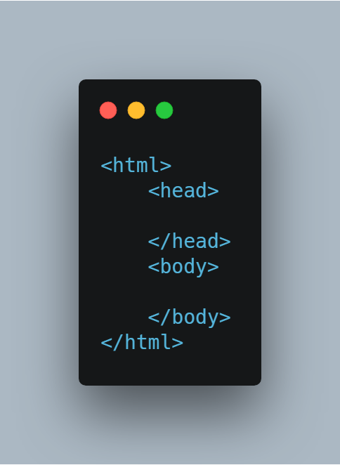
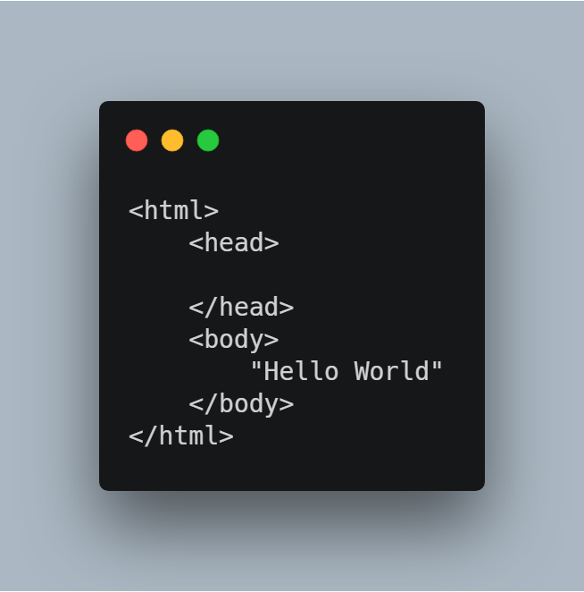

# Começando a entender o HTML

 O HTML como já vimos no texto da história da web, foi uma ferramenta criada por Tim Bernners Lee. O HTML (Hyper Text Markup Language em português Linguagem de Marcação de Hipertexto), sua função como próprio nome diz é marcação. O HTML diferente de outras linguagens que veremos mais a frente não é possível fazer contas, ifs/elses e outras coisas que veremos em linguagens como PHP e JavaScript. O HTML é uma linguagem de paradigma imperativo. São comandos de formatação são executados de acordo com o documento.

## Pontos importantes sobre o HTML

O HTML é formado por tags e tem como uma das  principais características o fato que, se um
browser não "entender" um determinado comando, este é ignorado e não é apresentado, não originando mensagem de erro e afetando minimamente o restante do documento.

## Nosso primeiro Hello World

Para podermos escrever páginas html é necessário a seguinte estrutura:

Escreva o código da imagem acima e salve dentro de uma pasta chamada de portfolio, e nomeie o arquivo como index.html, feito isso abra o arquivo em seu navegador e mande CTRL + U. Podemos perceber que nosso código já está sendo reconhecido pelo navegador, mas se a gente for olhar a janela que abrimos o nosso código, ele ainda não nos mostra nada. Para que possamos ver uma mensagem vamos então escrever o famoso "Hello World!" dentro das tags body de nosso documento.

Após escrever a mensagem, salve o documento e mande um F5 na página já aberta em seu navegador. Se você observar agora temos nossa mensagem sendo exbida, bem legal não é? Mas que tal irmos além disso? Veremos mais coisas em breve nosso próximo post ;)
